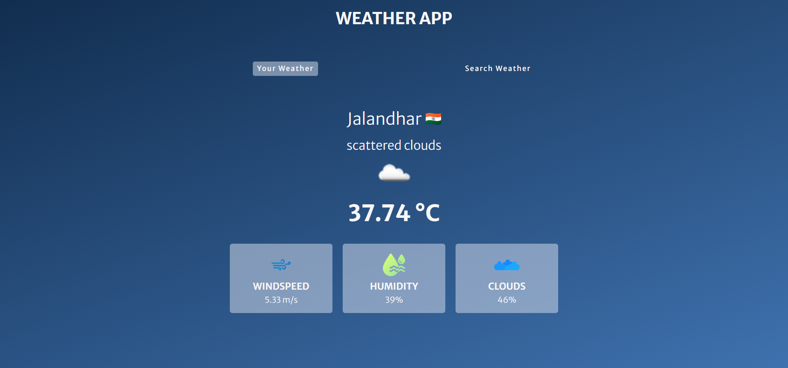
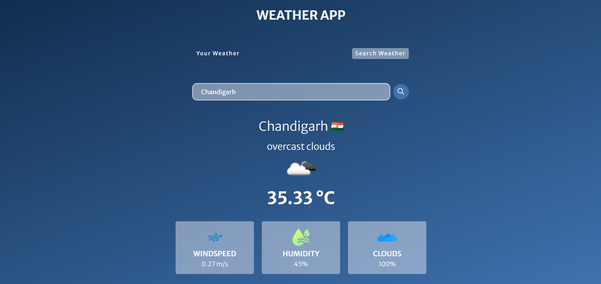

# Weather App

A simple weather application that allows users to view their local weather information and search for weather information in different cities. This application uses the OpenWeatherMap API to fetch weather data.

## Features

- Display user's local weather information by granting location access.
- Search for weather information by city name.
- Display weather parameters including temperature, wind speed, humidity, and cloudiness.
- Responsive design with a clean and minimalistic user interface.

## Technologies Used

- HTML
- CSS
- JavaScript
- OpenWeatherMap API

## Screenshots

### Home Page

### Search Tab

